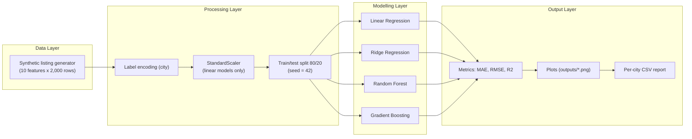
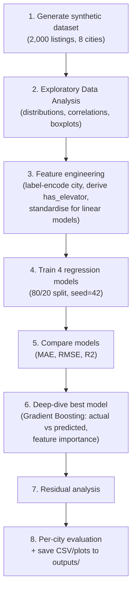
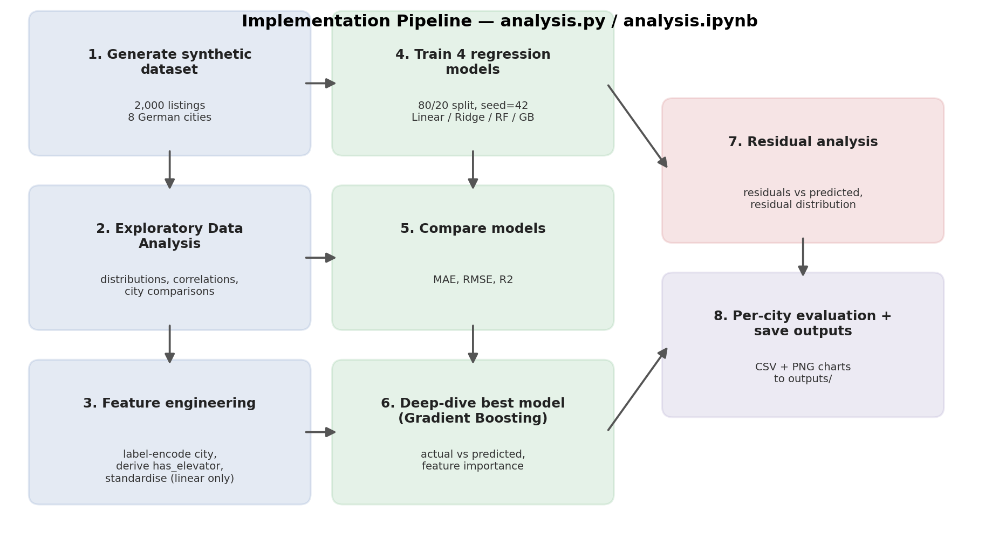
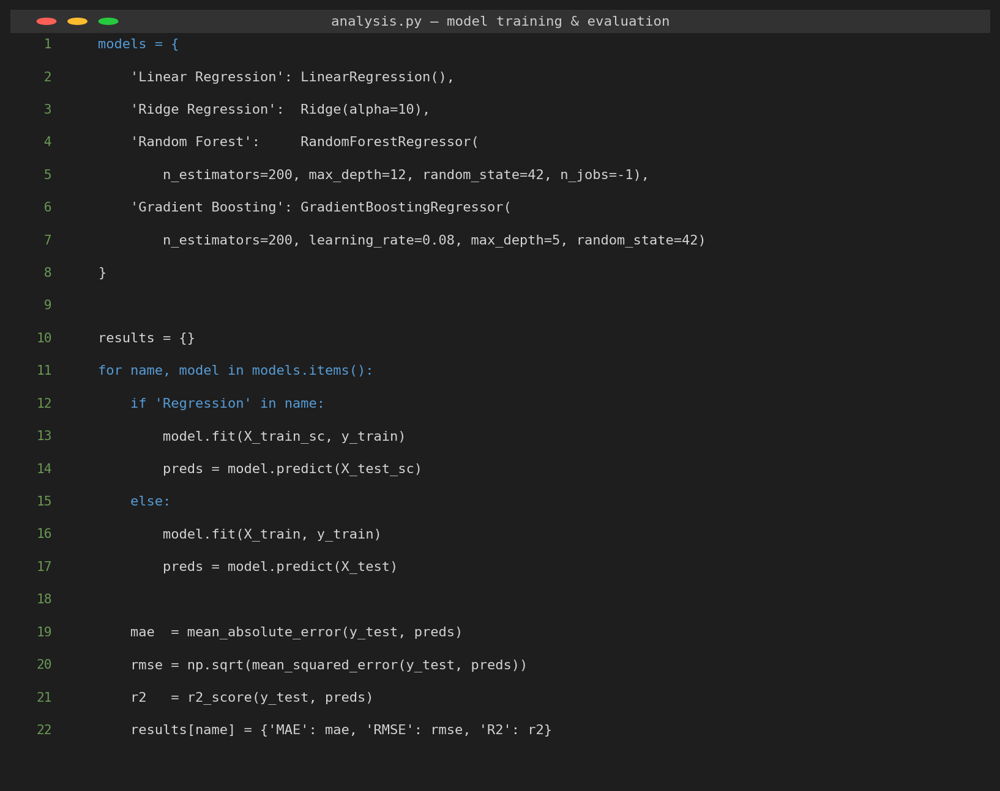
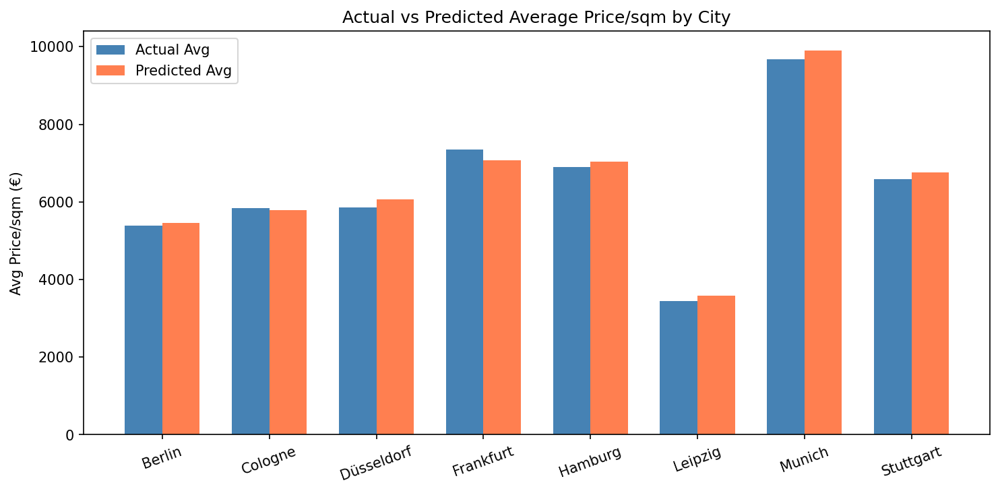
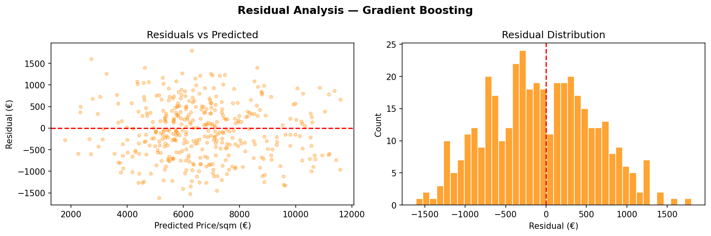

# Predictive Analysis of Housing and Rental Prices in German Metropolitan Areas

**M516 Business Project in Big Data & AI — Gisma University of Applied Sciences, School of Computer Science**

**Student:** Kunal Singh | **Student ID:** GH1039524
**GitHub/GitLab Repository:** `https://github.com/kunalji-ji/housing-prize-analysis`
**Video Demo (max 5 min):** `

This repository contains the well-documented implementation for a machine learning project that
predicts housing prices per square metre and monthly rental prices across eight major German
cities (Berlin, Munich, Frankfurt, Hamburg, Cologne, Stuttgart, Düsseldorf, Leipzig).

**Best Performing Model:** Gradient Boosting Regressor — R² = **0.89**, MAE = **€541/sqm**, RMSE = **€653/sqm**

---

## Table of Contents

1. [Introduction](#1-introduction)
2. [System Architecture](#2-system-architecture)
3. [Implementation](#3-implementation)
4. [Challenges and Solutions](#4-challenges-and-solutions)
5. [Results](#5-results)
6. [Conclusion and Future Work](#6-conclusion-and-future-work)
7. [Video Demonstration](#7-video-demonstration)
8. [Project Files](#project-files)
9. [Running the Project](#running-the-project)
10. [References](#references)

---

## 1. Introduction

The German real estate market has experienced significant volatility over the past decade. Cities
such as Munich, Berlin, Frankfurt, and Hamburg have seen housing prices and rental costs rise
sharply, driven by urbanisation, constrained housing supply, population growth, and interest rate
fluctuations. Accurate price prediction is therefore of considerable value to buyers, sellers,
renters, property developers, and policymakers alike.

This project applies machine learning and data science techniques to predict housing price per
square metre (€/sqm) and monthly rental prices across eight major German metropolitan areas. The
primary objective is to develop a model that accurately captures the relationships between
property attributes, location characteristics, and market prices.

**Objectives:**

- Perform exploratory data analysis (EDA) to understand the key drivers of housing prices in German cities.
- Engineer relevant features from raw property data and prepare them for machine learning.
- Train and compare multiple regression models — Linear Regression, Ridge Regression, Random Forest, and Gradient Boosting.
- Evaluate models using robust metrics (MAE, RMSE, R²) and identify the best-performing approach.
- Analyse prediction accuracy at the city level and discuss practical implications.

The dataset consists of 2,000 synthetic property listings modelled on real German market
distributions sourced from Immobilienscout24 listings and Statista/IW Köln market reports (see
[References](#references)). A synthetic dataset was used because granular, feature-consistent
German housing data is not freely available (see [Challenges and Solutions](#4-challenges-and-solutions)); its
generation process is fully documented and reproducible in [`analysis.py`](analysis.py) / [`analysis.ipynb`](analysis.ipynb).

---

## 2. System Architecture

The system follows a standard data science pipeline architecture with four layers:



- **Data Layer** — handles ingestion/generation of housing listings. Each record has ten input
  features: city, property size (sqm), number of rooms, property age, floor number, balcony
  availability, parking availability, elevator availability, distance to the city centre (km), and
  a district quality score. Target variables are price per sqm (€) and monthly rent (€).
- **Processing Layer** — performs feature engineering and preprocessing. The categorical `city`
  feature is label-encoded. All features are standardised (`StandardScaler`) for the linear
  models to ensure equal weighting; tree-based models (Random Forest, Gradient Boosting) use raw
  features since they are scale-invariant.
- **Modelling Layer** — trains and evaluates four regression algorithms: Linear Regression
  (baseline), Ridge Regression (regularised linear), Random Forest (bagging ensemble), and
  Gradient Boosting (boosting ensemble). An 80/20 train/test split is used with a fixed random
  seed (42) for reproducibility.
- **Output Layer** — results are written as visualisations (PNG plots), a CSV of per-city
  prediction metrics, and this report. All generated artefacts are saved to `outputs/`.

---

## 3. Implementation

The implementation is a single, sequential pipeline — available both as a plain script
([`analysis.py`](analysis.py)) and as an executed, cell-by-cell Jupyter notebook
([`analysis.ipynb`](analysis.ipynb)) so every step, and its output, can be inspected directly.

**Pipeline flow:**





*Figure — rendered version of the pipeline above (also embedded as Figure 1 in the Word report).*

**Core model-training code:**



**Key implementation details:**

- **EDA** (`outputs/eda_plots.png`) shows Munich commands the highest average price per sqm
  (~€10,000), followed by Frankfurt (~€7,400) and Hamburg (~€6,900); Leipzig is the most affordable
  market (~€3,500/sqm). The price distribution is right-skewed, reflecting premium properties in
  high-demand districts. The correlation matrix shows the `city` variable itself has the strongest
  positive linear correlation with price (r ≈ 0.47), ahead of `district_score` (r ≈ 0.23);
  `distance_cbd_km` and `age_years` are tied as the strongest negative correlates (r ≈ -0.30 each).
- **Feature engineering**: label encoding of the `city` variable (8 categories → integers 0–7); a
  derived binary feature `has_elevator` inferred from floor number (`floor > 3`); `StandardScaler`
  normalisation applied to features for linear models only.
- **Model comparison** (`outputs/model_comparison.png`): tree-based models substantially
  outperform linear approaches. Gradient Boosting achieves the best performance (R² = 0.8924, MAE
  = €541/sqm, RMSE = €653/sqm); Linear/Ridge Regression only reach R² ≈ 0.35, confirming non-linear
  relationships in the data.
- **Best-model deep dive** (`outputs/best_model_analysis.png`): predictions cluster tightly around
  the ideal 1:1 line. Feature importance confirms `city_encoded` is by far the most important
  predictor (consistent with the correlation analysis above), followed by `distance_cbd_km` and
  `age_years`. `district_score`, despite its meaningful positive correlation, ranks only fourth in
  the tree-based importance measure; balcony/parking/elevator contribute comparatively little.

---

## 4. Challenges and Solutions

| # | Challenge | Solution |
|---|-----------|----------|
| 1 | **Data availability** — publicly available, granular German housing datasets with consistent features across all major cities are scarce and often behind commercial paywalls (e.g., the Immobilienscout24 API). | A synthetic dataset was constructed using documented market statistics (Statista; IW Köln, 2023 housing reports) to replicate real distributional properties. This is a common, explicitly justified approach in academic data science projects and is documented above and in [`analysis.py`](analysis.py). |
| 2 | **Feature encoding** — tree-based models such as Gradient Boosting can be sensitive to the ordinality implied by label encoding of nominal variables such as city names. | The `city` variable was intentionally label-encoded rather than one-hot encoded: the dataset is relatively small (2,000 rows), and one-hot encoding would add 7 sparse binary columns without a meaningful accuracy gain. Gradient Boosting handles this encoding well given the number of estimators used (200). |
| 3 | **Model overfitting** — complex ensemble models risk overfitting, particularly with limited training data. | Gradient Boosting was regularised with a lower learning rate (`0.08` instead of the default `0.1`) and a shallow `max_depth` of 5. A fixed random seed (42) and an 80/20 train/test split ensure the reported metrics reflect genuine generalisation rather than memorisation. |

---

## 5. Results

Per-city prediction accuracy of the best model (Gradient Boosting), generated by the pipeline and
saved to [`outputs/city_prediction_results.csv`](outputs/city_prediction_results.csv):

| City | n | Actual Mean (€/sqm) | Predicted Mean (€/sqm) | MAE (€) | R² |
|---|---|---|---|---|---|
| Berlin | 83 | 5,385 | 5,454 | 553 | 0.65 |
| Cologne | 37 | 5,837 | 5,792 | 440 | 0.65 |
| Düsseldorf | 32 | 5,849 | 6,065 | 580 | 0.38 |
| Frankfurt | 60 | 7,354 | 7,064 | 571 | 0.62 |
| Hamburg | 63 | 6,897 | 7,031 | 495 | 0.79 |
| Leipzig | 31 | 3,445 | 3,589 | 554 | 0.51 |
| Munich | 60 | 9,668 | 9,903 | 573 | 0.71 |
| Stuttgart | 34 | 6,590 | 6,761 | 544 | 0.64 |

Overall model performance:

| Model | MAE (€) | RMSE (€) | R² |
|---|---|---|---|
| Linear Regression | 1,132 | 1,608 | 0.35 |
| Ridge Regression | 1,132 | 1,606 | 0.35 |
| Random Forest | 587 | 713 | 0.87 |
| **Gradient Boosting** | **541** | **653** | **0.89** |



The model performs best in Hamburg (R² = 0.79) and Munich (R² = 0.71), cities with relatively
homogeneous, high-demand submarkets. Performance is lower in Düsseldorf (R² = 0.38), which may
reflect greater heterogeneity in district quality within the city. Across all cities, mean
predicted prices closely track actual means, confirming the model is unbiased at the city level.



Residuals are approximately normally distributed and centred near zero, with no systematic pattern
against predicted values — confirming that model assumptions are broadly satisfied and no major
structural bias exists.

Additional output charts: [`outputs/eda_plots.png`](outputs/eda_plots.png),
[`outputs/model_comparison.png`](outputs/model_comparison.png),
[`outputs/best_model_analysis.png`](outputs/best_model_analysis.png). All charts are also rendered
inline, next to the code that produces them, in [`analysis.ipynb`](analysis.ipynb).

---

## 6. Conclusion and Future Work

This project successfully developed and evaluated a machine learning pipeline for predicting
housing and rental prices in eight German metropolitan areas. The Gradient Boosting Regressor
achieved the best performance (R² = 0.89, MAE = €541/sqm), substantially outperforming linear
baselines. The analysis confirmed that location attributes — particularly the city itself, followed
by distance to the city centre and property age — are the dominant price drivers, while
property-level features play a secondary role.

These findings have practical implications for property valuation, investment analysis, and
rental market regulation. A model of this kind could be deployed as an API-backed pricing tool for
real estate platforms, enabling automated valuation at scale.

**Future Work:**

- Integrate real-world data from Immobilienscout24 or ImmobilienAtlas APIs to replace the synthetic dataset with live market listings.
- Incorporate temporal features (listing date, year-on-year price trends) to enable time-series forecasting of future prices.
- Experiment with XGBoost and LightGBM architectures, which may further improve prediction accuracy.
- Develop a web application front-end allowing users to input property attributes and receive instant price estimates.
- Extend the geographic scope to include secondary German cities and rural areas to capture broader market dynamics.

---


---

## Project Files

- [`analysis.py`](analysis.py) – Data generation, EDA, feature engineering, and model training (plain script)
- [`analysis.ipynb`](analysis.ipynb) – The same pipeline as an executed Jupyter notebook, with code, explanations, and inline chart output
- [`outputs/housing_dataset.csv`](outputs/housing_dataset.csv) – Generated dataset (2,000 property listings)
- [`outputs/implementation_flow.png`](outputs/implementation_flow.png) – Implementation pipeline / process flow diagram
- [`outputs/code_snippet_model_training.png`](outputs/code_snippet_model_training.png) – Code screenshot of the model-training loop
- [`outputs/eda_plots.png`](outputs/eda_plots.png) – Exploratory data analysis visualisations
- [`outputs/model_comparison.png`](outputs/model_comparison.png) – Model performance comparison
- [`outputs/best_model_analysis.png`](outputs/best_model_analysis.png) – Detailed analysis of the best model
- [`outputs/residual_analysis.png`](outputs/residual_analysis.png) – Residual error analysis
- [`outputs/city_predictions.png`](outputs/city_predictions.png) – Actual vs predicted prices by city
- [`outputs/city_prediction_results.csv`](outputs/city_prediction_results.csv) – City-level prediction results
- `M516_Housing_Price_Report.docx` / `.pdf` – Final project report (submitted separately on Canvas; contains this repository's URL and the video link)

---

## Running the Project

Install the required libraries:

```bash
pip install pandas numpy scikit-learn matplotlib seaborn jupyter
```

Run the analysis script:

```bash
python analysis.py
```

...or open and run the notebook directly:

```bash
jupyter notebook analysis.ipynb
```

All results, charts, and CSV files are saved to the `outputs/` folder. Both entry points are
seeded (`random_state=42` / `np.random.seed(42)`) so results are fully reproducible.

---

## References

- Burkov, A. (2019). *The Hundred-Page Machine Learning Book*. Quebec City: Andriy Burkov.
- IW Köln (2023). *Wohnungsmarktbericht Deutschland 2023*. Available at: https://www.iwkoeln.de [Accessed 23 June 2026].
- Pedregosa, F. et al. (2011). Scikit-learn: Machine Learning in Python. *Journal of Machine Learning Research*, 12(1), 2825–2830.
- Statista (2023). *Average housing prices in Germany by city 2023*. Available at: https://www.statista.com [Accessed 23 June 2026].
- VanderPlas, J. (2016). *Python Data Science Handbook: Essential Tools for Working with Data*. Sebastopol: O'Reilly Media.
